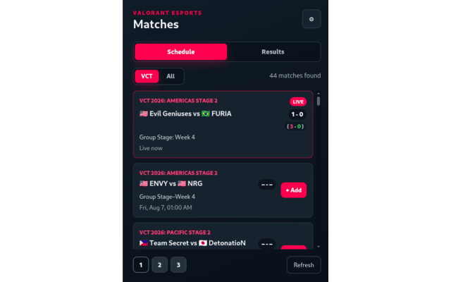
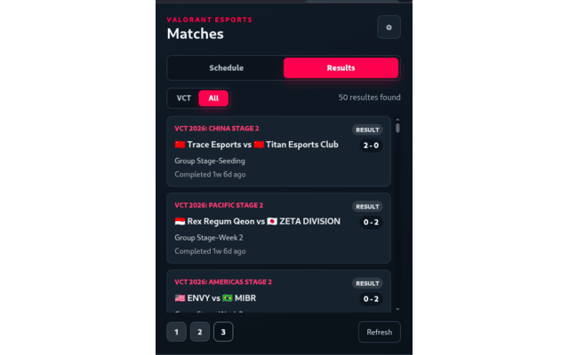
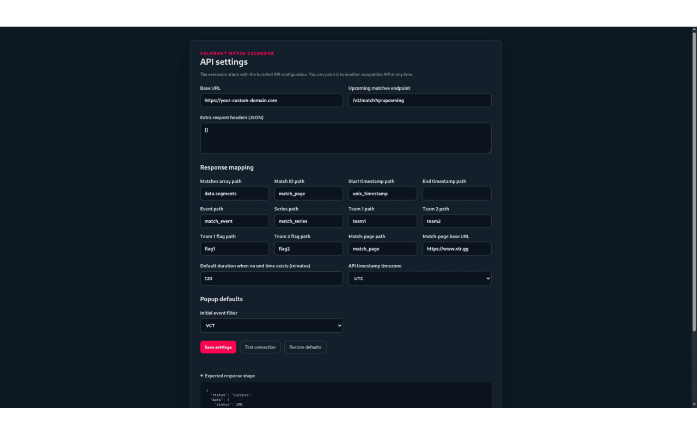
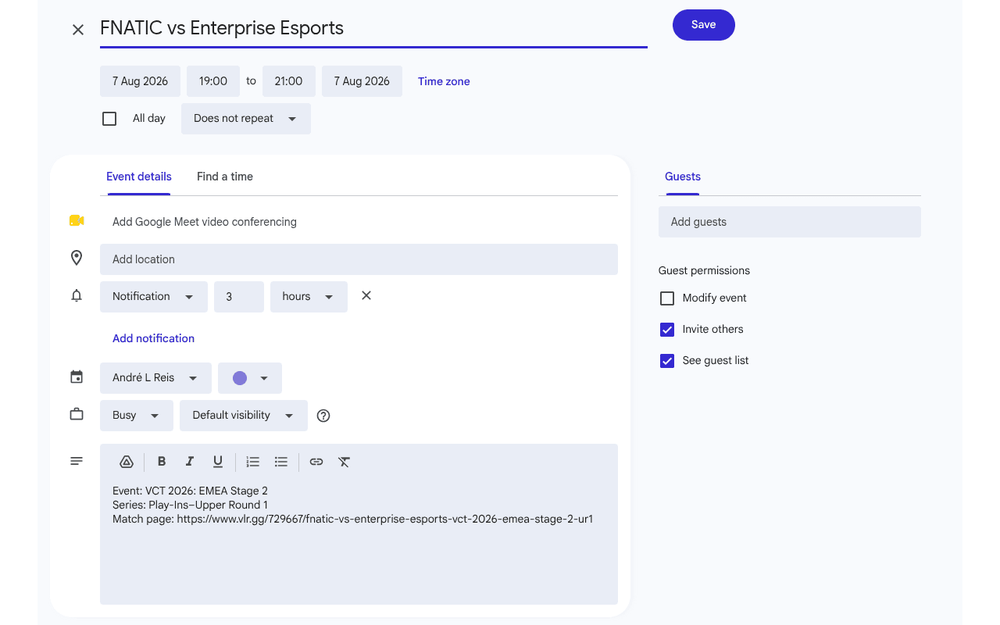

# Valorant Match Calendar, TypeScript edition

Tired of having to perform multiple clicks and types to check the next Valorant games? This chrome extension, with the integration of an API like the [vlrggapi](https://github.com/axsddlr/vlrggapi) you can have all the upcoming/live and previous results at one click away!

Tired of forgetting your favourite matches, add them to your Google Calendar or enable the notifications setting so you never miss a match!

## Project structure

The Chrome extension and the PWA are built from the same TypeScript
source under `src/`, split so platform-specific code (`chrome.*`,
`localStorage`, `window.*`) never leaks into the shared logic or UI:

```text
src/
  core/                    Platform-agnostic logic. No chrome.*/window.* calls.
    types.ts               Shared type definitions.
    config.ts              Default config, legacy-config normalization.
    matches.ts             Fetching, mapping, filtering, calendar URLs.
    storage.ts             ConfigStorage port + load/save helpers.
    index.ts               Barrel re-export of the above.

  ui/                      Shared DOM views. Take a small platform object
                            as a parameter instead of calling chrome.*/
                            window.* directly.
    matchListView.ts       Renders the match list (popup.html / pwa-index.html).
    settingsFormView.ts    Renders the settings form (options.html / pwa-settings.html).

  platform/
    extension/             Adapters backed by chrome.* APIs.
      storage.ts           ConfigStorage via chrome.storage.sync/local.
      links.ts             openLink via chrome.tabs.create, openSettings
                            via chrome.runtime.openOptionsPage.
      permissions.ts       ensureOrigins via chrome.permissions.
    pwa/                   Adapters with no browser-extension API.
      storage.ts           ConfigStorage via localStorage.
      links.ts             openLink via window.open, openSettings via
                            a page navigation.
      permissions.ts       ensureOrigins no-op (see caveat below).
      registerServiceWorker.ts

  background.ts            Extension-only: chrome.alarms + chrome.notifications
                            polling for live matches. No PWA equivalent.
  popup.ts                 Extension entry: mounts ui/matchListView with
                            the extension platform adapters.
  options.ts               Extension entry: mounts ui/settingsFormView with
                            the extension platform adapters.

  pwa-app.ts               PWA entry: mounts ui/matchListView with the PWA
                            platform adapters (pwa-index.html).
  pwa-settings.ts          PWA entry: mounts ui/settingsFormView with the
                            PWA platform adapters (pwa-settings.html).
  pwa-sw.ts                PWA service worker: caches the app shell for
                            offline/instant loading. No live-match logic.
```

`core/` and `ui/` have no dependency on any browser-extension or
web-only API — they take small interfaces (`ConfigStorage`, `openLink`,
`openSettings`, `ensureOrigins`) as parameters, and each platform's
`platform/<name>/` folder is the implementation of those interfaces.
This is what lets the extension and the PWA share the fetching,
filtering, rendering, and settings-form code entirely, while each
keeps its own thin adapter to the host environment.

**Caveat:** `platform/pwa/permissions.ts`'s `ensureOrigins` is a
permanent no-op, not a placeholder — a PWA has no permission-prompt
model for arbitrary origins like `chrome.permissions` does. A `fetch`
to a configured API either works or fails under CORS, with nothing to
request.

## Develop and build the extension

```bash
npm install
npm run typecheck
npm run build:extension
```

Compiled bundles are placed in `dist/` (`popup.js`, `options.js`,
`background.js`), read directly by `popup.html` / `options.html` /
`manifest.json`.

## Install the extension locally

1. Run the build commands above, or use the already included `dist/` output.
2. Open `chrome://extensions`.
3. Enable **Developer mode**.
4. Select **Load unpacked** and choose this project folder.
5. Open **Settings**, configure the API and save it.

## Develop and build the PWA

```bash
npm install
npm run typecheck
npm run build:pwa
```

Compiled bundles are placed in `dist/pwa/` (`pwa-app.js`,
`pwa-settings.js`) plus `pwa-sw.js` at the project root (the service
worker has to live next to `pwa-index.html`/`pwa-settings.html` for its
default scope to cover the whole app — see the comment in
`platform/pwa/registerServiceWorker.ts`).

`npm run build` runs both `build:extension` and `build:pwa`; `npm run
typecheck` covers both too (the service worker is checked separately,
via `tsconfig.sw.json`, because its `WebWorker` lib can't coexist with
the `DOM` lib the rest of `src/` uses).

## Run the PWA locally

The PWA is static files — serve the project root with any static file
server and open the page in a browser:

```bash
npx serve .
# or: python -m http.server 8080
```

Then open `pwa-index.html`. The service worker requires a secure
context, so `http://localhost` works for development, but a real
deployment needs HTTPS.

**Not implemented for the PWA:** live-match notifications. The
extension's 5-minute `chrome.alarms` polling (`background.ts`) has no
PWA equivalent without standing up a real push server, so the
notification checkbox and "Test notification" button in the settings
form are hidden on the PWA (`supportsLiveNotifications: false` in
`pwa-settings.ts`) rather than shown non-functional.

## Deploy the PWA to Vercel

The repo root mixes the PWA's static files with the Chrome extension's
(`manifest.json`, `popup.html`, `dist/background.js`, ...), so
`vercel.json` points Vercel at a generated `public/` folder instead of
deploying the whole repo:

```json
{
  "buildCommand": "npm run build:pwa",
  "outputDirectory": "public"
}
```

`npm run build:pwa` ends by running `scripts/build-pwa-site.mjs`, which
copies just the PWA's files (`pwa-index.html`, `pwa-settings.html`,
`manifest.webmanifest`, `styles.css`, `icons/`, `dist/pwa/`,
`pwa-sw.js`) into `public/` — nothing extension-only ships. `public/`
is gitignored; Vercel regenerates it on every deploy, so there's
nothing to keep in sync by hand. A rewrite sends `/` to
`/pwa-index.html` so the bare domain serves the app.

To deploy:

- **Vercel CLI** — run `npx vercel` from the project root, follow the
   prompts to log in and link a project, then `npx vercel --prod` to
   ship. Vercel reads `vercel.json` automatically.

Either way, Vercel serves over HTTPS by default, which the service
worker requires.

## API support

- Configure the API endpoints and fields to match your API response structure
- Optional request headers represented as JSON
- Configurable dot paths for the matches array and match fields
- ISO-8601, Unix-second and Unix-millisecond timestamps

## Preview

### Chrome extension
<p align="center">
  
  
</p>

<p align="center">
  
  
</p>

### PWA